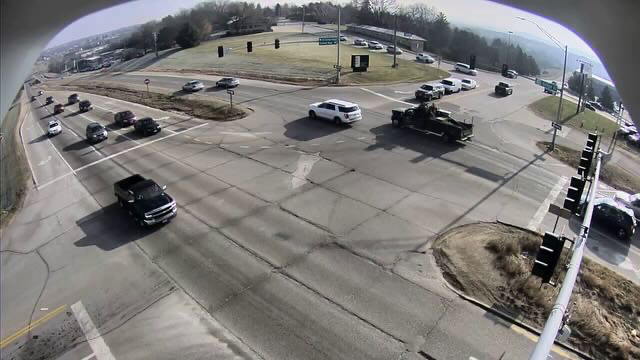
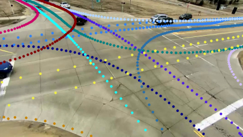

<div align="center">

# Ground Plane Projection for Improved Traffic Analytics at Intersections

**IEEE ITSC 2024**

**Sajjad Pakdamansavoji**, Kumar Vaibhav Jha, Baher Abdulhai, James H Elder

¹Department of Electrical Engineering and Computer Science, York University, Toronto, ON, Canada · ²Department of Civil and Mineral Engineering, University of Toronto, Toronto, ON, Canada

[](https://arxiv.org/abs/2511.12342)
[](https://sajjadpsavoji.github.io/Ground-Plane-Projection/)
[](https://huggingface.co/papers/2511.12342)
[](LICENSE)

</div>



---

> **Note**
> This repository is a placeholder. The paper and project page are live; **code release is in progress**.
> Watch or star the repo to be notified when it lands.

## Abstract

Accurate turning movement counts at intersections are important for signal control, traffic management and urban planning. Computer vision systems for automatic turning movement counts typically rely on visual analysis in the image plane of an infrastructure camera. Here we explore potential advantages of back-projecting vehicles detected in one or more infrastructure cameras to the ground plane for analysis in real-world 3D coordinates. For single-camera systems we find that back-projection yields more accurate trajectory classification and turning movement counts. We further show that even higher accuracy can be achieved through weak fusion of back-projected detections from multiple cameras. These results suggeest that traffic should be analyzed on the ground plane, not the image plane

## News

- **2026-09** &mdash; Paper released on [arXiv](https://arxiv.org/abs/2511.12342) and indexed on [Hugging Face](https://huggingface.co/papers/2511.12342).
- **2026-09** &mdash; Project page live at [sajjadpsavoji.github.io/Ground-Plane-Projection](https://sajjadpsavoji.github.io/Ground-Plane-Projection/).

## Getting Started

_Code coming soon._ The intended entry point:

```bash
git clone https://github.com/SajjadPSavoji/Ground-Plane-Projection.git
cd Ground-Plane-Projection
pip install -r requirements.txt
```

## Results



_Add a quantitative results table here._

## Citation

If you find this work useful, please cite:

```bibtex
@article{pakdamansavoji2025ground,
  title   = {Ground Plane Projection for Improved Traffic Analytics at Intersections},
  author  = {Sajjad Pakdamansavoji and Kumar Vaibhav Jha and Baher Abdulhai and James H Elder},
  journal = {arXiv preprint arXiv:2511.12342},
  year    = {2025}
}
```

## Links

- 📄 [Paper (arXiv)](https://arxiv.org/abs/2511.12342)
- 🌐 [Project page](https://sajjadpsavoji.github.io/Ground-Plane-Projection/)
- 🤗 [Hugging Face](https://huggingface.co/papers/2511.12342)
- 👤 [Google Scholar](https://scholar.google.com/citations?user=DZzLzNwAAAAJ)
- 💼 [LinkedIn](https://www.linkedin.com/in/sajjad-pakdaman-savoji/)
- ✉️ [sj.pakdaman.edu@gmail.com](mailto:sj.pakdaman.edu@gmail.com)

## Contact

For questions about the paper, data, or code release, contact
**Sajjad Pakdamansavoji** &mdash; [sj.pakdaman.edu@gmail.com](mailto:sj.pakdaman.edu@gmail.com).

## Acknowledgements

Supported by the Centre for Vision Research (CVR) and Centre for AI & Society (CAIS) at York University, the Vector Institute for Artificial Intelligence, the Region of York, and Trans-Plan.

## License

Released under the [MIT License](LICENSE).
